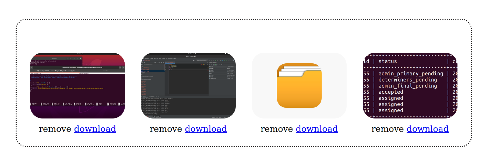
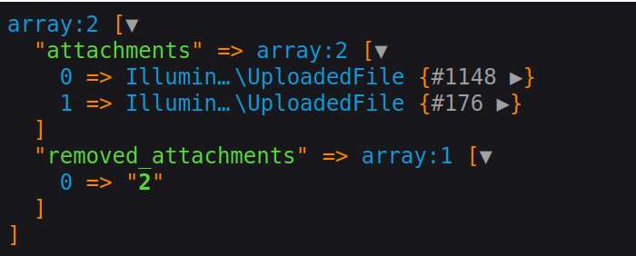

# Challeh

challeh is a javascript uploader plugin. it makes it possible to send and edit multiple/form-data
forms. previewing files before sending and display files that are included in the form edit.

### why to use?

most uploader plugins use ajax to send request, apart from the main form. so there are
two routes for uploading a form , one for sending files and another for sending text-based input.

the majority cause of this approach is the possibility to update files without sending all former updated
files again.

challeh make a convenient way to send and update multiple files with the main form post request , only
one route to post a form with files and test-based inputs.

- send files with main form
- possibility to choose multiple files
- validate file based on file size.
- possibility to download selected files
- possibility to remove files

<p align="center"> 

</p>

## Getting Started

### Installing

firstly clone the project. then add css and javascript files to your root file.

you can see a simple example :

```html

<link rel="stylesheet" href="/src/css/style.css">

<form id="form" method="post">
    <div id="challeh_container"></div>
    <input type="submit" value="submit">
</form>

<script src="/src/js/main.js"></script>
<script>
    Challeh({
        // options
        container: '#challeh_container',
        inputName: "attachments",
    });

</script>
```

as you can see above `Challeh` constructor accepts an object with needed options.

### attachments

consider you want to update a from with files. so pass the files array to `attachments` property.
files are displayed and to remove them from server , plugin create an hidden input
named `removed-attachment` . the id of file to delete by clicking on remove button is pushed
to this input. then this input is passed to server and the at server-side you can handle
to delete these files with related id from database or disk.
the elements of array are required to have `id`, `url`, `name` properties.
<p align="center"> 

</p>

```javascript
    Challeh({
    attachments: [
        {
            id: 1,
            url: 'https://encrypted-tbn0.gstatic.com/images?q=tbn:ANd9GcQ38o64k7JbkK1R89zaHxq4v6cUWRVNaJkbfigHwdYaTg&s',
            name: 'fd',
        },
        {
            id: 2,
            url: 'https://encrypted-tbn0.gstatic.com/images?q=tbn:ANd9GcQ38o64k7JbkK1R89zaHxq4v6cUWRVNaJkbfigHwdYaTg&s',
            name: 'fd',
        }
    ],

});
```

### maxFileSize

you can validate selected file based on maximum of valid file size:

```javascript
    Challeh({
    maxFileSize: 12 // in bytes
});
```

### multiple

if you need to set the file input as array you can accomplish this using `multiple:true`

```javascript
   Challeh({
    multiple: true // boolean value
});
```

## Author

make me happy by any feedbacks and comments

* **Zohreh Daeian**  - [ZohrehDa](https://github.com/zohrehda)
